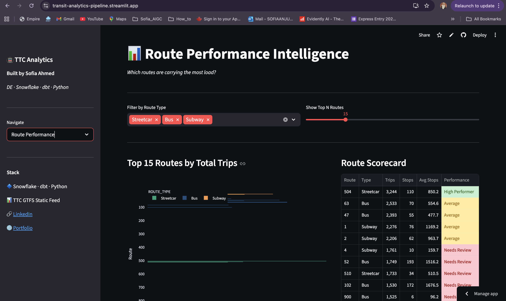
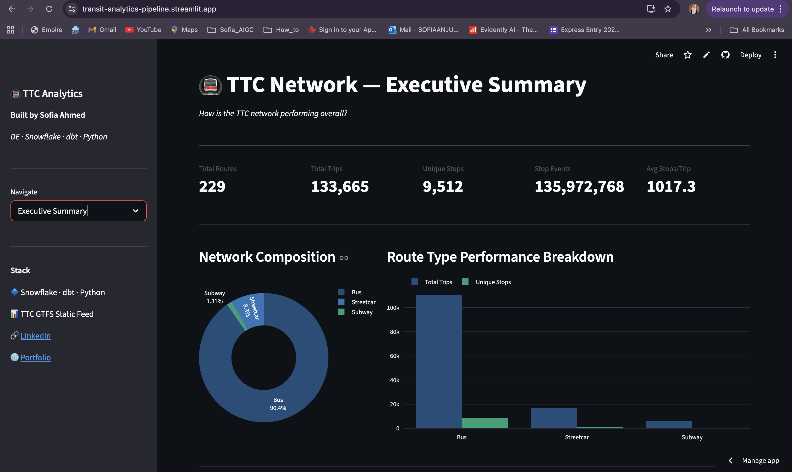
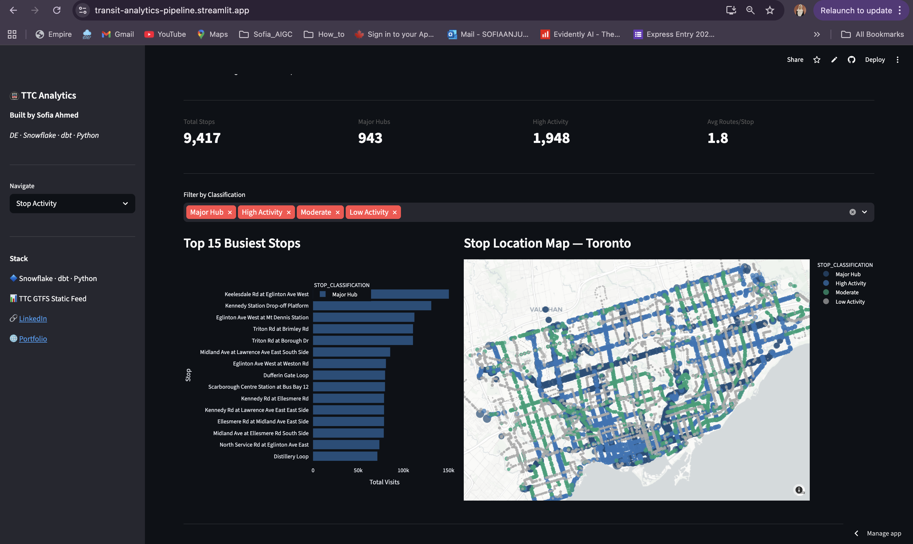
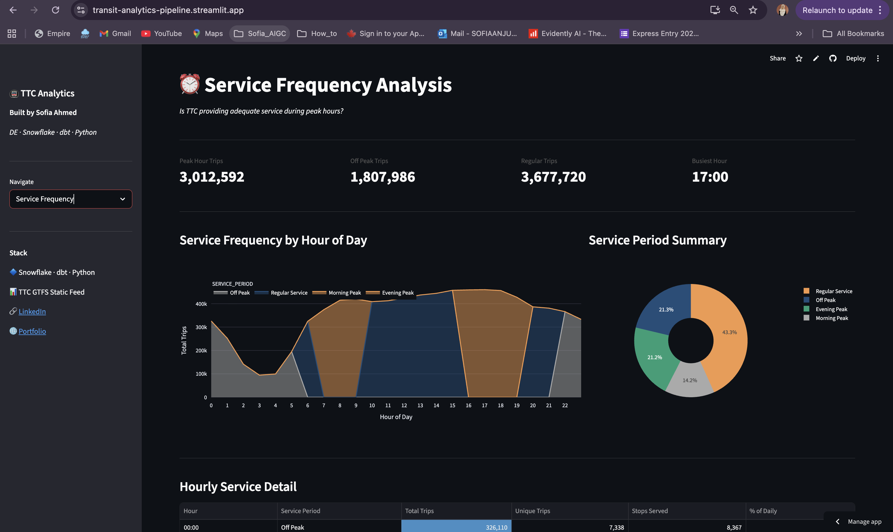
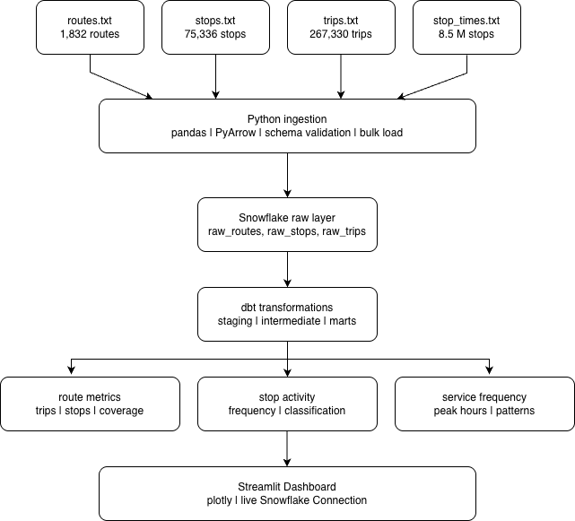

# TTC Transit Analytics Pipeline

A production-style, end-to-end data engineering pipeline built on real Toronto Transit Commission (TTC) GTFS data. Raw transit files are ingested, validated, transformed through layered dbt models in Snowflake, and served as analytics-ready tables powering a live interactive dashboard.

**Live Dashboard: [transit-analytics-pipeline.streamlit.app](https://transit-analytics-pipeline.streamlit.app)**

---

## What This Project Does

Most data engineering portfolios use toy datasets or synthetic data. This project uses the actual TTC GTFS static feed — the same format transit agencies worldwide use to publish their schedules — and builds a full analytics stack on top of it.

The pipeline processes:

- 229 routes across Bus, Subway, and Streetcar networks
- 9,512 stops classified by activity level across Toronto
- 267,330 scheduled trips
- 135 million+ stop events processed end-to-end

The result is a five-page analytics dashboard that answers real operational questions about the TTC network.

---

## Dashboard

### Executive Summary


Network-wide KPIs — total routes, trips, stops, and stop events — with route type composition and performance breakdown by transit mode.

### Route Performance


Top routes ranked by trip volume, color-coded by route type, with a route scorecard showing performance classification and a complexity scatter plot.

### Stop Activity


Stop classification (Major Hub, High Activity, Moderate, Low Activity) with an interactive Toronto map showing all 9,512 stops plotted by coordinates and activity level.

### Service Frequency


Hourly trip volume across the full day, highlighting morning peak (7-9 AM), evening peak (4-7 PM), and off-peak periods with a service period breakdown.

### Trip Patterns


Inbound vs outbound trip distribution by route type, route complexity analysis, and a full trip patterns table with directional breakdowns.

---

## Architecture



```
TTC GTFS Static Files
(routes, stops, trips, stop_times)
          |
          v
Python Ingestion Layer
  - Schema validation and type coercion
  - PyArrow bulk loading to Snowflake
  - Handles GTFS edge cases (e.g. times past 24:00)
          |
          v
Snowflake Raw Layer
(RAW_ROUTES, RAW_STOPS, RAW_TRIPS, RAW_STOP_TIMES)
          |
          v
dbt Transformation Layer
  - Staging: clean and standardize raw tables
  - Marts: business-ready aggregations
          |
          v
Mart Tables
(mart_route_performance, mart_stop_activity,
 mart_service_frequency, mart_trip_patterns,
 mart_network_overview)
          |
          v
Streamlit Dashboard
(live at transit-analytics-pipeline.streamlit.app)
```

---

## Tools and Technologies

| Layer | Tool | Why |
|-------|------|-----|
| Ingestion | Python, pandas, PyArrow | Schema validation, efficient bulk loading |
| Warehouse | Snowflake | Scalable cloud data warehouse |
| Transformation | dbt | Modular, testable SQL models with lineage |
| Dashboard | Streamlit, Plotly | Interactive visualizations, live Snowflake connection |
| Data format | GTFS Static Feed | Industry-standard transit specification |

---

## dbt Models

```
transit_dbt/models/
|
+-- staging/
|   +-- stg_routes.sql          # Route type normalization
|   +-- stg_stops.sql           # Stop coordinates and names
|   +-- stg_trips.sql           # Trip and direction mapping
|   +-- stg_stop_times.sql      # Time parsing, hour extraction
|   +-- stg_calendar.sql        # Weekday / weekend classification
|
+-- marts/
    +-- mart_route_performance.sql   # Trips, stops, avg stops per route
    +-- mart_stop_activity.sql       # Visit counts, activity classification
    +-- mart_service_frequency.sql   # Hourly trip volume and peak periods
    +-- mart_trip_patterns.sql       # Inbound/outbound, complexity metrics
    +-- mart_network_overview.sql    # Network-level summary by route type
```

---

## Data Source

**TTC GTFS Static Feed** — publicly available from the Toronto Transit Commission.

| File | Rows | Description |
|------|------|-------------|
| routes.txt | 1,832 | All TTC routes |
| stops.txt | 75,336 | Stop locations with coordinates |
| trips.txt | 267,330 | Scheduled trips per route |
| stop_times.txt | 8,498,298 | Arrival and departure times at each stop |

---

## Business Questions This Pipeline Answers

| Question | Model |
|----------|-------|
| Which routes carry the highest passenger load? | mart_route_performance |
| Where are the busiest transfer hubs in Toronto? | mart_stop_activity |
| Is service adequate during morning and evening peak hours? | mart_service_frequency |
| How are inbound and outbound trips distributed? | mart_trip_patterns |
| What percentage of trips does each route type carry? | mart_network_overview |

---

## Engineering Challenges

**GTFS time format** — stop_times can contain values like 25:30:00 to represent trips past midnight. The staging model handles this with conditional hour extraction so downstream models work correctly.

**Data volume** — 8.5 million rows in stop_times required PyArrow for efficient bulk loading rather than row-by-row inserts. Load time dropped significantly.

**Stop classification** — mart_stop_activity uses Snowflake window functions (PERCENTILE_CONT) to classify stops into activity tiers based on their relative visit counts across the full network.

**Pipeline modularity** — staging models clean and standardize raw data, mart models join and aggregate. Each layer is independently testable and replaceable without touching the others.

---

## Running the Project

```bash
# Clone and set up
git clone https://github.com/Sofiaanjum/transit-analytics-pipeline.git
cd transit-analytics-pipeline
python -m venv venv
source venv/bin/activate
pip install -r requirements.txt

# Configure Snowflake credentials
cp .env.example .env

# Run ingestion
python ingestion/load_gtfs_static.py

# Run dbt transformations
cd transit_dbt
dbt run
dbt test

# Launch dashboard
cd ..
streamlit run dashboard/app.py
```

---

## Roadmap

- [ ] GTFS Realtime feeds for live delay and vehicle position tracking
- [ ] Airflow DAGs for scheduled pipeline runs
- [ ] dbt tests for data quality enforcement
- [ ] Incremental dbt models for efficient daily refresh

---

## Author

**Sofia Ahmed** — Data Engineer

[LinkedIn](https://www.linkedin.com/in/sofiaanjum) | [Portfolio](https://sofiaanjum.github.io/webportfolio/) | [Live Dashboard](https://transit-analytics-pipeline.streamlit.app)

Azure Data Engineer Associate (DP-203) | Databricks Certified Data Engineer | AWS Cloud Practitioner
